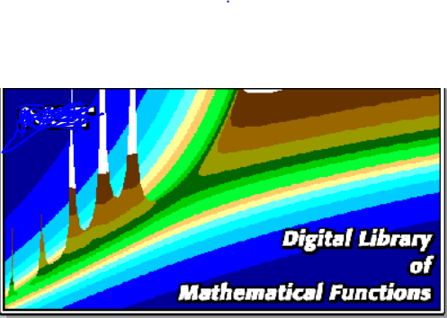

## Math prototypes/dump from different sources and projects/courses 

\
\
Applying different math concepts into one hotpot project.

## Some Todo when time

- [ ] Project Euler tasks [Project Euler](https://projecteuler.net/)
- [ ] Math in games [Math for gamedevelopers](https://www.youtube.com/playlist?list=PLW3Zl3wyJwWOpdhYedlD-yCB7WQoHf-My)
- [ ] Leet Code problems [l33tCode](https://leetcode.com/)
- [ ] Some linear algebra course

