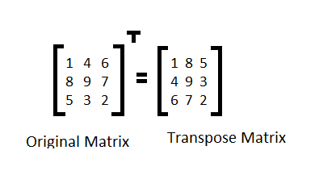

## Transpose operation 

\
\
Transpose operation in different styles and languages 

## TODO

- [x] [Java](#)
- [ ] [Js](#) 
- [ ] [Ts](#) 
- [ ] [C++](#)
- [ ] [LeetCode](https://www.youtube.com/watch?v=VDw9y6nX_ss) Todo poista tämä jos ei tarvita

## Some additional sources

- [Link 1](https://www.javatpoint.com/java-program-to-transpose-matrix)
- [Video 1](https://www.youtube.com/watch?v=W91jxpTte_k)

